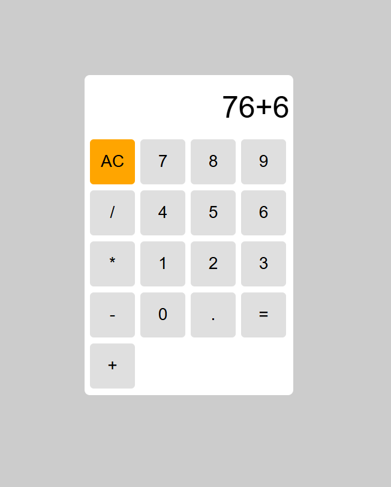

# 🧮 Calculator App

A simple and responsive Calculator built with HTML, CSS, and JavaScript.  
This project demonstrates DOM manipulation, event handling, and basic arithmetic operations.

---

## 🛠️ Technologies Used
- HTML5 – Structure  
- CSS3 – Styling and layout  
- JavaScript (ES6) – Functionality and calculations  

---

## ✨ Features
- Basic arithmetic operations: ➕ ➖ ✖️ ➗   
- Clear and reset functions  
- Responsive design for all screen sizes  
- User-friendly interface  

## Image

